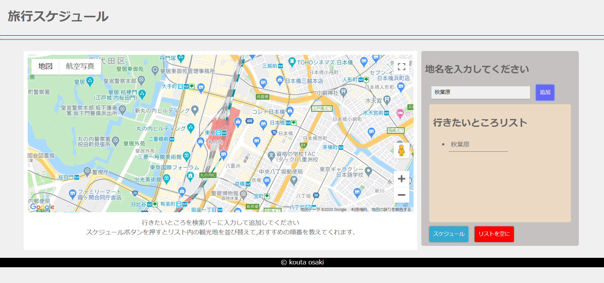
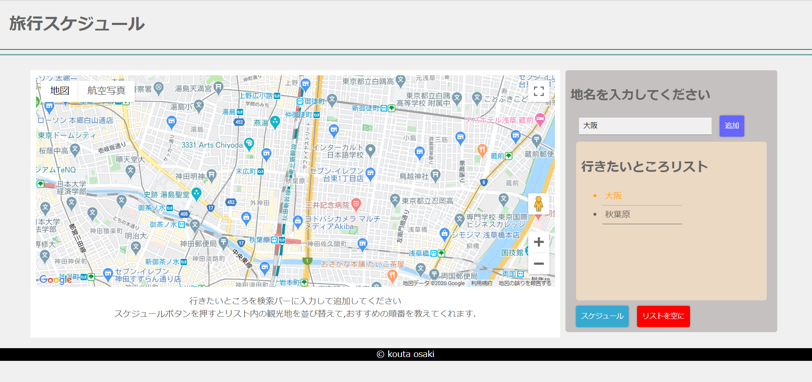

# Sightseeing-Scheduling

<h2>どんなアプリ？</h2>

行きたい観光地の順番を決めてくれるアプリです。

検索バーに行きたい観光地を入力し
 
追加ボタンを押すと行きたい場所のリストに加えられます。
 
スケジューリングボタンを押すとリスト内の場所を最適な順番に並び替えてくれます。

<h2 textaligh = "center">使い方</h2>

サイドバーの中にある検索バーに地名を入力し追加ボタンを押してください
 
リストの中に地名が追加されます。
 
 

リスト内の地名をクリックするとgoolemapは地名周辺を描写します。
 
スケジュールボタンを押すと地名の座標を基準に行く順番を並び替えてくれます。

## 公開先

<a href = "https://sightseeingscheduling.web.app/">https://sightseeingscheduling.web.app</a>
